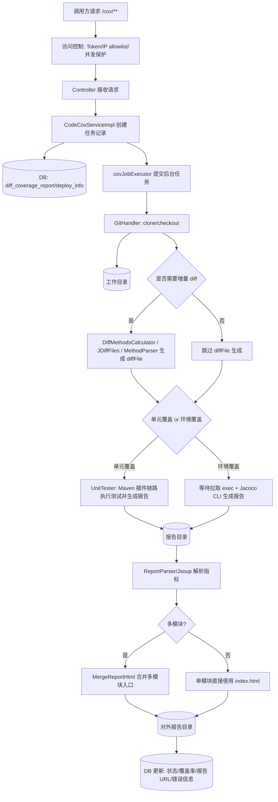
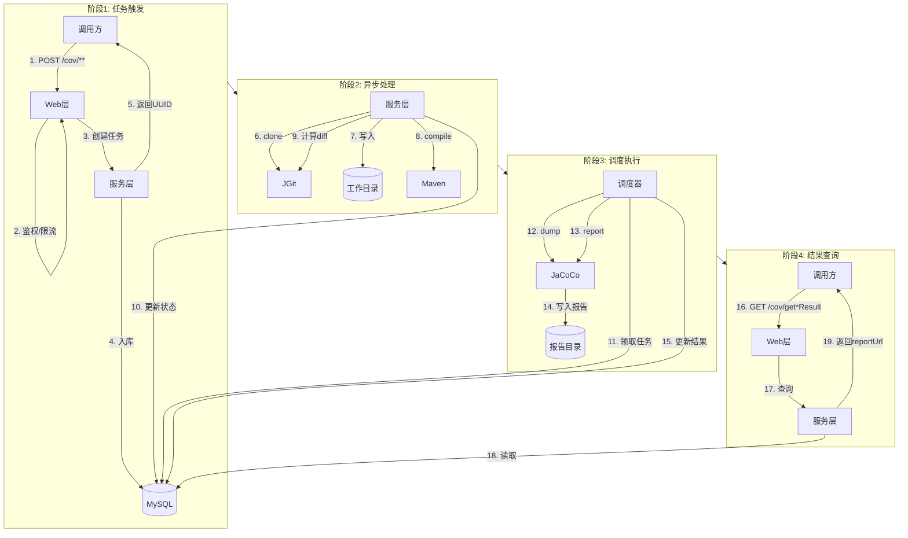
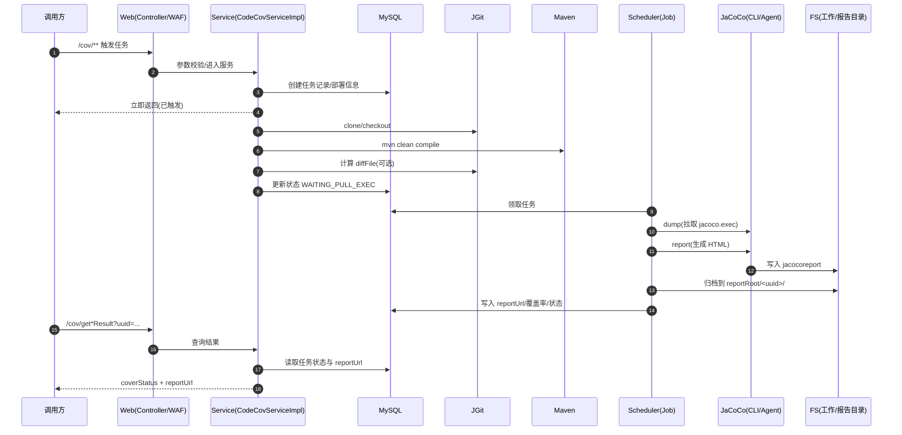
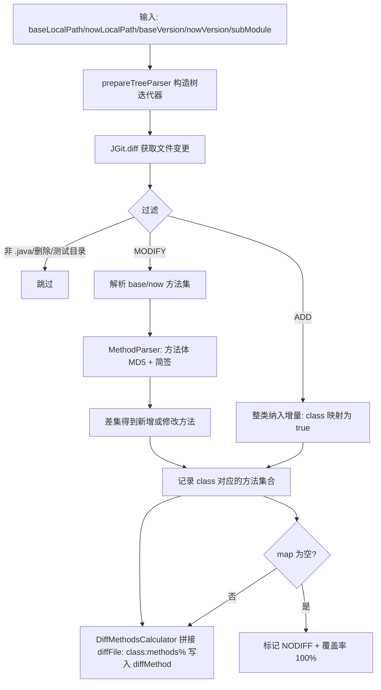
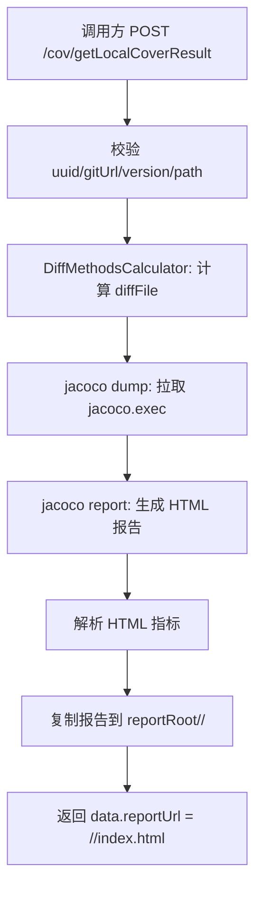
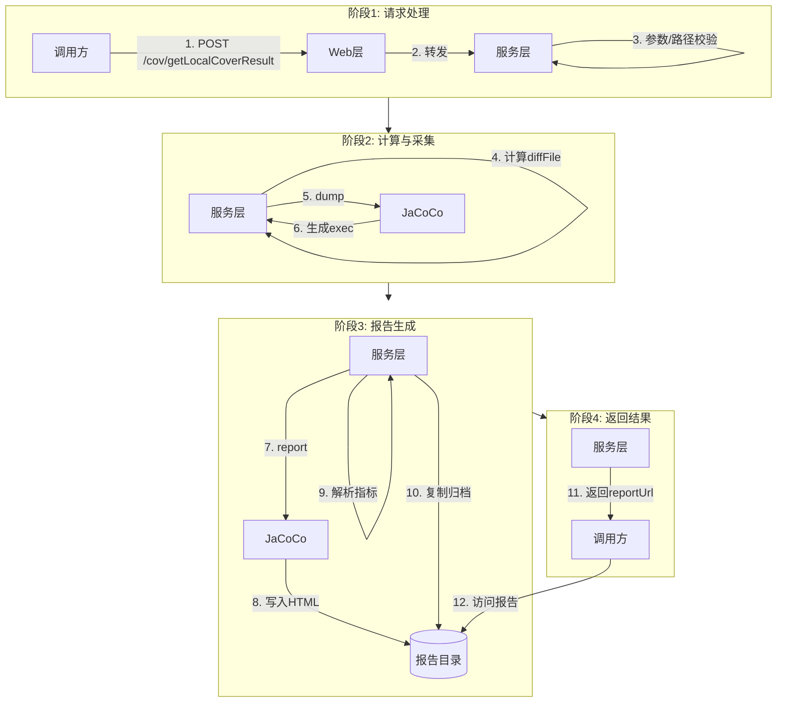
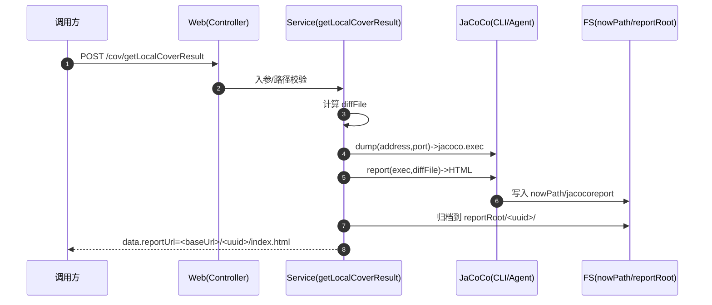
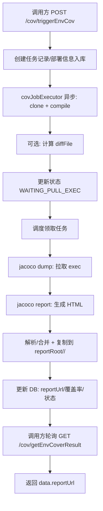
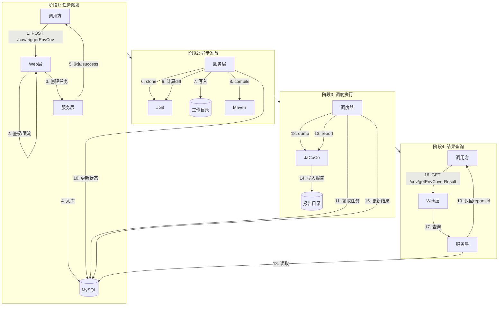
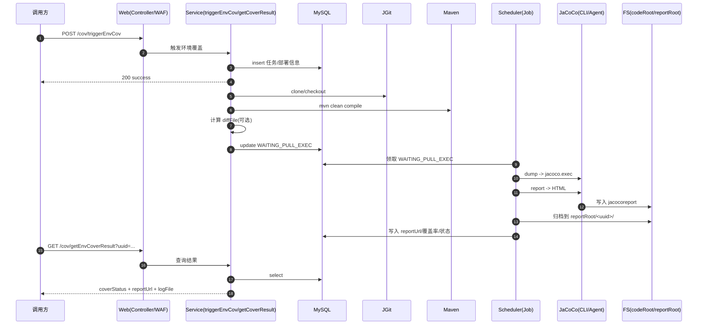

**概述**
- 目标：分析 didi/super-jacoco 增量行覆盖率的实现方式，明确流程与关键模块，并给出工程化要点与改进建议。
- 结论：项目通过 Git 差异分析得到“增量方法集”，在单元/环境覆盖两种模式下使用 JaCoCo 报告过滤功能生成增量覆盖率报告，并解析 HTML 汇总指标。

**工作流程**
- 入口服务：CodeCovServiceImpl 按阶段推进：克隆代码 → 计算增量方法 → 添加 Maven 集成模块 → 执行测试 → 解析报告 → 复制报告并清理代码。
- 增量方法计算：DiffMethodsCalculator 组织调用，生成 diffFile 串写入 CoverageReportEntity，用于 Jacoco 过滤。
- 报告生成：单元覆盖由 UnitTester 触发 Maven 插件生成；环境覆盖由 calculateEnvCov 触发 Jacoco CLI 报告生成。
- 报告解析与合并：通过 Jsoup 解析 HTML 获取指标，并用 MergeReportHtml 合并多模块报告。

**流程图（总览）**

**泳道图（总览：单元覆盖 + 环境覆盖）**

**时序图（总览：单元覆盖 + 环境覆盖）**

**关键模块**
- 增量方法计算：JDiffFiles.diffMethodsListNew
- 使用 JGit 比较 base/now 两版本树，过滤 src/test/java 与非 .java 变更，区分 ADD/Modify 类型。
- ADD：整类纳入增量，值为 "true"；MODIFY：对比方法 MD5，纳入新增/修改方法集合。
- 方法抽取与签名哈希：MethodParser
- 利用 JavaParser 遍历 MethodDeclaration，方法体串进行 MD5；值记录为 方法名+参数类型的简签。
- 代码克隆与校验：GitHandler
- 基于 JGit 进行 clone 和 checkout；支持凭证配置与仓库有效性检测。

**差异方法计算**
- 输入：
- baseLocalPath、nowLocalPath、baseVersion、nowVersion、subModule。
- 过程：JDiffFiles.diffMethodsListNew
- 构造树迭代器：prepareTreeParser；调用 Git.diff 获取文件级变更。
- 非 java/删除/测试目录变更跳过，ADD → map.put(class,"true")；MODIFY → 解析 base/now 的方法 MD5，差集即增量方法。
- 输出：HashMap<className, "methodA#methodB#...">；为空则直接标记 100% 覆盖并 NO_DIFF 报告。
- 组织串：DiffMethodsCalculator.executeDiffMethods 将 map 以 "class:methods%" 拼接为 diffFile，写入 CoverageReportEntity.diffMethod。

**报告生成与解析**
- 单元覆盖（Maven 插件）：UnitTester
- 命令：mvn clean org.jacoco:jacoco-maven-plugin:prepare-agent compile test-compile maven-surefire-plugin:test maven-jar-plugin:jar org.jacoco:jacoco-maven-plugin:report -Djacoco.diffFile=<diff串>
- 当 diffFile 存在时，Jacoco 插件使用自定义参数实现增量过滤生成 HTML 报告。
- 状态机：成功标记 UNITTEST_DONE，失败/超时记录错误并更新状态。
- 环境覆盖（Jacoco CLI）：calculateEnvCov
- 步骤：jacoco dump 从运行环境拉取 exec → jacoco report 生成 HTML（按模块追加 --sourcefiles/--classfiles），当 diffMethod 存在追加 --diffFile。
- 解析：用 Jsoup 读取 coveragetable/tfoot 中的指标（Missed/Total/Lines/Branches）计算百分比；复制报告到对外目录并设置链接。
- 报告合并：MergeReportHtml
- 逐模块 index.html 的 tbody 汇总，tfoot 指标相加并重新计算总计百分比；用于生成统一的增量报告入口页。

- 报告生成逻辑（单元覆盖）：在代码克隆、增量方法计算和集成模块添加完成后，通过构建链路执行测试并生成覆盖率 HTML 报告；报告首先落在对应任务的工作目录下，随后被复制到统一的报告根目录中。
- 报告生成逻辑（环境覆盖）：调度任务在发现需要环境覆盖的任务后，从目标服务拉取运行时执行轨迹文件，再结合差异方法配置生成覆盖率 HTML 报告；生成过程同样按模块组织，并在完成后复制到统一的报告根目录中。
- 报告存储与访问：所有任务的覆盖率报告都会按任务 ID 归档在报告根目录下的独立子目录中，入口文件为 index.html；应用将报告根目录暴露为静态资源根目录，因此可以通过 HTTP 直接访问形如 `http://<host>:<port>/<uuid>/index.html` 的地址查看对应任务的覆盖率报告。

**本地模式 vs 非本机路径模式（流程差异）**

当前图中“单元覆盖 / 环境覆盖”是覆盖率来源的两种大类；而“本地模式 / 非本机路径模式”是环境覆盖里两种不同的接入方式：

- 本地模式：`POST /cov/getLocalCoverResult`，调用方显式提供本机源码/产物路径（同步返回结果）。
- 非本机路径模式：`POST /cov/triggerEnvCov` + `GET /cov/getEnvCoverResult`，服务端根据 gitUrl 拉代码并编译（异步任务 + 轮询）。

两者在流程上有明显差异：

- 是否需要 DB：本地模式不依赖任务入库；非本机路径模式依赖 MySQL 存储任务/部署信息与状态机。
- 是否异步：本地模式同步计算并返回；非本机路径模式先触发后轮询，真正“拉 exec + 生成报告”由调度任务执行。
- 代码来源：本地模式直接读调用方提供的路径；非本机路径模式由服务端 clone 到 `cov.paths.codeRoot` 并在该目录编译。

**本地模式：流程图**

**本地模式：泳道图**

**本地模式：时序图**

**非本机路径模式：流程图**

**非本机路径模式：泳道图**

**非本机路径模式：时序图**

**两种模式对比**
- 单元覆盖：
- 适合 CI 场景，完整编译与测试链路，可自动控制 diffFile 与模块集成；报告解析稳定。
- 环境覆盖：
- 适合已有服务的集成/回归测试场景，通过 dump exec 拉轨迹并按模块生成报告，增量过滤同样依赖 diffFile。

**工程化要点**
- diffFile 协议："<class>:<method1#method2#...>%"；缺省时生成全量报告；存在时生成增量报告。
- 变更过滤：跳过删除/测试目录；子模块路径匹配用于限定扫描范围。
- 指标解析：HTML 表结构需稳定；遇到分母为 0 的情况做 1/1 防除零处理（见 MergeReportHtml）。
- 清理策略：生成成功后清理 clone 目录，防止磁盘占用；失败时保留日志方便排查。

**与 JaCoCo 部署方式的对应关系**
- 支持的部署方式：Maven 插件、Java Agent、CLI。
- 未覆盖的部署方式：Ant 任务、离线插桩。
- 依据：
- 单元覆盖使用 Maven 插件链路生成报告。
- 环境覆盖使用 jacoco dump 与 jacoco report 的 CLI 组合。
- 运行时采集通过 Java Agent 方式输出 exec（环境覆盖侧的 dump 即对 agent 输出的 exec 进行抓取）。

**JaCoCo 版本依赖与升级方式**
- 依赖形态：
- jacoco CLI 的可执行 jar 作为运行时工具使用。
- 自带的 jacoco 相关 jar 用于 agent 与 CLI。
- Maven 插件由项目构建依赖控制。
- 升级方式：
- 替换本仓库内 jacoco 目录中对应的 agent/cli 产物，并保持配置引用路径一致。
- 更新 pom.xml 中 jacoco-maven-plugin 版本，并同步插件配置所需参数（包括 diffFile 扩展参数）。
- 如需统一管理版本，建议在构建配置中收敛到单一版本号并确保插件与 CLI/agent 版本一致。

**JacocoPlus vs super-jacoco 对比**

| 维度 | JacocoPlus | super-jacoco |
|---|---|---|
| 项目定位 | JaCoCo 的二次开发/源码级改造，更偏“覆盖率引擎能力增强” | 覆盖率统计服务/平台，更偏“端到端自动化产出增量报告” |
| 增量覆盖的核心思路 | 基于 JGit 做分支/Tag 差分，拿到变更文件与变更行区间；再基于 AST 比对得到“增量方法集”；报告侧对源码展示做增量标识（例如对新增行做标记） | 基于 JGit 做 commit 差分，得到变更 Java 文件；对 MODIFY 文件用方法体哈希得到“增量方法集”；把增量集合编码成 diffFile 传给 JaCoCo 的报告生成链路做过滤 |
| “增量”的粒度（实际影响统计口径） | 以“方法”为主，辅以“行区间”用于展示标记；严格到“只统计变更行”的口径需要额外能力（例如按行过滤计数） | 以“方法”为主（修改方法内的所有行都会进入增量范围），更接近“增量方法覆盖率”而非“增量行覆盖率” |
| 变更行的处理 | 能拿到新增/删除行区间，可用于在 HTML 源码页中把变更行可视化标记 | 不做行级差分标记，核心输出是增量方法集合 |
| 变更方法识别 | 基于 JDT AST 解析源代码，按“方法名+参数”匹配，再用方法体哈希判断是否变化 | 基于 JavaParser 解析源代码，构造“方法名+参数类型”简签，并用方法体 MD5 做差异判断 |
| 对重载/重写的鲁棒性 | 按“方法名+参数”区分重载，通常可用；但遇到复杂泛型/导入解析问题仍可能误判 | 以简化的参数类型拼接为主，重载场景更容易误判（尤其是类型解析不完整时） |
| 与 JaCoCo 五种部署方式的关系 | 作为 JaCoCo 源码级项目，包含 agent、cli、maven-plugin、ant、离线插桩等模块；但“增量能力”主要落在 diff 计算与报告展示/生成链路上 | 主要覆盖 Maven 插件（单测）、Java Agent（运行时采集）、CLI（dump/report），并在这条链路上实现增量过滤 |
| 产出物形态 | 需要构建并使用其改造后的 JaCoCo 产物（通常包括 core/report 相关 jar，实际落地时还要考虑 agent/cli/plugin 版本一致性） | 仓库内自带 JaCoCo 相关 jar/插件产物（自定义版本），服务在运行时直接调用这些产物生成报告 |
| 接入方式 | 更适合嵌入到现有覆盖率报告生成代码/工具中；也可二次封装成 CLI/服务 | 已封装成服务化流程（克隆/计算 diff/测试/报告/发布），更适合直接落到团队流水线/平台 |
| 运维成本 | 维护 JaCoCo Fork 成本高：升级上游版本需要处理冲突与回归验证 | 维护业务侧流程成本更高（依赖 Git/Maven/运行环境/网络/权限），但不必深度跟随 JaCoCo 上游演进 |
| 适用场景 | 需要“在报告里直观看到变更行/文件的覆盖情况标记”，且愿意维护 JaCoCo 定制版本 | 需要“自动化产出增量覆盖率报告（方法级）+ 平台化查询”，且希望流程一键化 |
| 主要优势 | 源码级能力更强：可把 diff 行信息融入报告呈现；可扩展空间大（例如将来做真正按行统计） | 端到端可用：流程编排齐全；同时覆盖单测与环境覆盖两类场景；更贴近 DevOps 落地 |
| 主要劣势/风险 | 维护成本与兼容性压力大；如果要做到“只统计变更行”的严格口径，需要进一步改造计数与过滤链路 | “增量行覆盖率”本质更接近“增量方法覆盖率”；方法体 MD5 + 简签对重载/重构不够鲁棒；对 Maven 构建与工程结构依赖强 |

**选择建议**
- 你要的是“平台化、自动化、一键跑出增量覆盖报告（偏方法粒度）”：优先选 super-jacoco。
- 你要的是“报告里能明确标出哪些行是本次变更（可视化友好），并愿意维护 JaCoCo 定制版本”：优先选 JacocoPlus。
- 你要的是“严格的增量行覆盖率口径（只统计 Git diff 的变更行命中情况）”：
- JacocoPlus 更接近这条路线（它已经把变更行区间带进来了），但仍需要把“行级差分”真正接入覆盖率计数口径；
- super-jacoco 需要从“方法级 diff”升级为“行级 diff”，并在报告生成/指标统计阶段按行过滤计算。

**局限与改进建议**
- 方法签名唯一性：当前以方法体 MD5 + 简签识别，重载/重写场景可能误判；可引入 ASM 基于字节码签名（owner+name+desc）增强唯一性。
- 差异方法定位：仅比对方法体整体 MD5，无法细化到“行级 diff”；可结合 Git 差异的行级信息与 Jacoco 行命中矩阵进一步过滤。
- 多语言支持：当前仅 Java；如需 Kotlin/Scala 等需扩展解析器与 classfiles 路径策略。
- 报告解析：HTML 结构变动会影响解析；优先采用 Jacoco XML 报告并直接读取指标更稳健。
- 性能与大仓适配：在超大仓或多模块单体场景下，当前流程可能存在 clone/编译/报告解析偏重的问题，可通过本地代码镜像复用、增量拉取与耗时指标采集，为后续性能调优提供基础。
- 任务模型与扩展性：任务调度依赖 DB + 本地线程池，在多实例和高并发场景下的水平扩展能力有限，可预留 MQ 或任务队列集成点，并通过任务归属标识支持多实例分片与监控。
- 配置与可观测性：关键运行参数虽已配置化，但缺乏统一的配置总览与指标维度，可补充“参数与默认值”文档，并输出任务成功率、耗时、外部命令超时/失败等指标，便于运维调优。
- 覆盖率口径与解释：当前统计口径更接近“增量方法覆盖率”，容易被误解为严格的“增量行覆盖率”，建议在报告入口或接口返回中显式标注口径，并预留将来升级为行级 diff + 行级统计的扩展空间。
